## 一、简单版本


1. 用户请求： https://xx.domain → Cloudflare (DNS + 反向代理 + HTTPS终止 + 安全防护)。
2. Cloudflare → 前端层： Cloudflare 进行负载均衡，将请求分发到多个前端服务器。
3. 前端服务器内部： 每个前端服务器运行：
   - Web应用容器 (如 Next.js)。
   - 一个 Nginx 实例 (作为本地反向代理)。
   - Nginx 将前端渲染请求发给本地的 Next.js 容器，将 API请求 转发给后端层。
4. 前端 → 后端层： 前端服务器上的 Nginx 将 API 请求 (/api/*) 负载均衡转发到多个后端服务器。
5. 后端服务器： 运行 Flask/Django 等应用容器，处理业务逻辑。
6. 后端 → 数据层： 后端应用直接连接独立的 DB服务器 和 Redis服务器。
7. 数据层安全： DB/Redis 服务器的防火墙配置仅允许后端服务器的IP白名单访问。
### 配置说明
1. Cloudflare 配置
   - DNS： xx.domain → 指向 前端服务器的公网IP列表 (或多个CNAME，如 frontend.xx.domain)
   - 负载均衡：
      - 创建 Load Balancing Pool，添加所有前端服务器的公网IP+端口 (通常是 :80)。
      - 创建 Load Balancer，指定域名 (如 xx.domain)，关联上面的 Pool。
   - SSL/TLS： 模式设为 灵活 (Cloudflare HTTPS → 前端服务器 HTTP)。
   - 防火墙/WAF： 配置规则阻挡恶意流量、爬虫、CC攻击等。
2. 前端服务器配置 (每个实例)
- Nginx (核心)：
```Nginx
# 监听 80 端口 (接收 Cloudflare 的 HTTP 请求)
server {
    listen 80;
    server_name xx.domain;

    # 静态文件服务 (Next.js 生成)
    location /_next/static {
        alias /path/to/nextjs/static/files;
        expires 365d;
    }

    # 前端路由请求 -> 本机 Next.js 容器 (通常 3000 端口)
    location / {
        proxy_pass http://localhost:3000;
        proxy_set_header Host $host;
        proxy_set_header X-Real-IP $remote_addr;
        proxy_set_header X-Forwarded-For $proxy_add_x_forwarded_for;
        proxy_set_header X-Forwarded-Proto $scheme;
    }

    # API 请求 -> 负载均衡到后端服务器集群
    location /api/ {
        # 指向后端服务器组的负载均衡池
        proxy_pass http://backend_upstream;
        proxy_set_header Host $host;
        proxy_set_header X-Real-IP $remote_addr;
        proxy_set_header X-Forwarded-For $proxy_add_x_forwarded_for;
        proxy_set_header X-Forwarded-Proto $scheme;
    }
}

# 定义后端服务器组 (负载均衡池)
upstream backend_upstream {
    # 列出所有后端服务器的内网IP或域名 + 端口 (推荐内网IP)
    server 10.0.1.101:8000;  # 后端服务器1
    server 10.0.1.102:8000;  # 后端服务器2
    # server backend2:8000; # 如果用内部DNS解析
    # 负载均衡策略 (可选)
    least_conn;             # 最少连接数
    # zone backend_zone 64k; # 需要Nginx Plus
}
```
- Next.js 容器： 运行在 3000 端口，只处理前端渲染和静态资源。
- 防火墙： 开放 80 端口给 Cloudflare IP 白名单。
3. 后端服务器配置 (每个实例)
- 运行应用容器： Flask监听端口 (如 :8000)。
- 连接数据库： 应用配置文件中，数据库地址指向 DB服务器的内网IP/域名 (如 db.xx.internal:5432)，Redis指向 Redis服务器 (如 redis.xx.internal:6379)。
- 无状态设计： 确保会话(Session)存储在Redis中，上传文件使用对象存储(S3/OSS)，保证后端可随时扩容。
- 防火墙： 仅开放应用端口 (如 8000) 给 前端服务器的内网IP白名单。
4. DB服务器 & Redis服务器配置
- 运行服务： PostgreSQL 和 Redis。
- 监听地址： 绑定到内网IP (如 10.0.1.200) 或 0.0.0.0 (配合防火墙)。
- 防火墙 (关键安全措施)：
   - DB 服务器： 仅允许 后端服务器的内网IP 访问数据库端口 (如 5432)。
   - Redis 服务器： 仅允许 后端服务器的内网IP 访问 Redis 端口 (如 6379)。
   - 拒绝所有其他IP！
- 增强安全：
   - 数据库配置 pg_hba.conf GRANT 权限，限制来源IP和用户。
   - Redis 设置密码 (requirepass) 并禁用高危命令 (rename-command FLUSHDB "")。

### 方案优势：
1. 弹性扩展：
   - 前端层： 根据流量独立扩展 Next.js 实例 (无状态)。
   - 后端层： 根据 API 负载独立扩展 Flask 实例 (无状态)。
   - 代理层： 每个前端服务器自带 Nginx，无需集中式 LB 瓶颈。

2. 职责分离： 各层专注自身任务 (渲染/API/数据)，故障隔离性好。

3. 安全分层：
   - Cloudflare 提供边缘安全。
   - DB/Redis 通过防火墙/IP白名单严格隔离。

4. 性能： 后端直连 DB/Redis，路径最短。

### 进阶
1. 使用 Terraform/CloudFormation 自动化创建服务器和网络。
2. 用 Docker Compose/Kubernetes 管理容器部署。
3. 配置 集中式日志 (ELK/Grafana Loki) 和 监控 (Prometheus/Grafana)。
4. 对 DB/Redis 实施定期备份和恢复演练。


## 二、充分利用cloudflare的混合部署方案


**将 Next.js 前端部分拆分，一半部署在 Cloudflare 边缘网络，一半保留在自建服务器**。
这种**混合部署策略**既能规避 Cloudflare Workers 的限制（如 CPU 时间、内存、无状态等），又能通过分布式架构提升容错能力。

---

### 一、架构设计（混合部署）


#### 1. **Cloudflare 运行部分**（轻量、无状态）
- **适用场景**：
  - 静态资源（JS/CSS/图片）
  - 边缘缓存的页面（SSG/ISR）
  - 轻量 API（无 DB/Redis 依赖）
  - 中间件（重定向、A/B 测试）
- **具体技术**：
  - **静态资源** → 托管到 **Cloudflare R2**（兼容 S3）
  - **边缘逻辑** → 通过 **Cloudflare Workers** + **Next.js Edge Runtime** 运行
  - **缓存页面** → 使用 **Cloudflare Cache** 加速 SSG/ISR 内容

#### 2. **自建服务器运行部分**（重量级、有状态）
- **适用场景**：
  - 需要访问 DB/Redis 的动态渲染（SSR）
  - 计算密集型任务
  - 长会话操作（如 Websockets）
  - 需原生模块支持的 API

---

### 二、具体实现步骤

#### 步骤 1：拆分 Next.js 应用
```typescript
// next.config.js
module.exports = {
  // 标记边缘兼容的组件
  experimental: {
    runtime: "experimental-edge", // 在Cloudflare Workers运行
  },
};

// 页面级配置 (page.tsx)
export const runtime = "edge"; //  适合边缘运行的页面
// 不设置 runtime 的页面默认在自建服务器运行 
```

#### 步骤 2：部署到 Cloudflare 边缘
1. **静态资源上传 R2**：
   ```bash
   next build && next export
   aws s3 sync out/ s3://your-bucket --endpoint-url=https://r2.cloudflarestorage.com
   ```

2. **边缘逻辑部署 Workers**：
   ```bash
   # 使用 @cloudflare/next-on-pages
   npx @cloudflare/next-on-pages@latest
   wrangler deploy
   ```

#### 步骤 3：自建服务器部署
```docker
# docker-compose.yml (自建部分)
services:
  next-server:
    image: your-next-app
    environment:
      RUNTIME_ENV: "self-hosted" # 标记自建环境
    ports:
      - "3000:3000"

  nginx:
    image: nginx
    ports:
      - "80:80"
    volumes:
      - ./nginx.conf:/etc/nginx/nginx.conf
```

#### 步骤 4：Cloudflare 路由分流


在 Cloudflare 配置规则：
1. **路径分流**：
   - `/*.js|/*.css|/*.jpg` → 直接访问 R2
   - `/api/edge/*` → 转发到 Workers
   - 其他请求 → 回源到自建服务器

2. **智能容错**：
   ```javascript
   // Workers 故障转移逻辑
   addEventListener('fetch', event => {
     event.respondWith(
       handleRequest(event.request).catch(() => {
         // Workers失败时回退到自建服务器
         return fetch(`https://self-hosted.com${new URL(event.request.url).pathname}`)
       })
     )
   })
   ```

---

### 三、优势与容错机制

#### 双重容错设计
| 故障点          | 应对方案                     |
|-----------------|-----------------------------|
| Cloudflare 故障 | 自动回退到自建服务器         |
| 自建服务器故障  | Cloudflare 缓存兜底 + 健康检查 |
| DB 访问失败     | 边缘返回降级内容 (Stale-While-Revalidate) |

#### 规避 Workers 限制


- **Cloudflare 处理**：短时任务 (<10ms CPU)、无状态请求
- **自建服务器处理**：长时任务、DB/Redis 交互、WebSockets

#### 性能优化
1. **边缘缓存**：热数据缓存命中率 >90%
2. **并行处理**：静态资源 (R2) 和动态内容 (自建) 并行加载
3. **减少回源**：通过 `stale-while-revalidate` 降低自建服务器压力

---

### 四、安全加固措施

1. **通信加密**：
   - 自建服务器 ↔ Cloudflare：启用 **mTLS**
   - 前端 ↔ 后端：强制 HTTPS

2. **访问控制**：
   ```nginx
   # nginx 配置 (自建服务器)
   location / {
     allow 192.0.2.0/24; # Cloudflare IP 段
     deny all;
     proxy_pass http://next-server:3000;
   }
   ```

3. **密钥管理**：
   - Workers 密钥 → 使用 **Cloudflare Secrets**
   - 自建服务器密钥 → **HashiCorp Vault**

---

### 五、流量分配建议
通过 **Cloudflare Load Balancing** 动态调整流量比例：


根据实时监控动态调整：
- **边缘负载高** → 增加自建服务器流量
- **自建服务器延迟高** → 增加边缘流量

---

### 最终架构收益
1. **成本优化**：减少 40-60% 的自建服务器开销
2. **延迟降低**：边缘用户首屏加载 <800ms
3. **容错提升**：单点故障影响降低 70%
4. **规避限制**：突破 Workers CPU/内存限制

> **部署工具推荐**：  
> - 边缘部分：`wrangler` + `@cloudflare/next-on-pages`  
> - 自建部分：`Terraform` + `Ansible` + `Docker Swarm/Kubernetes`  
> - 流量管理：Cloudflare Load Balancing + Argo Smart Routing


## 三、cloudflare + 多next前端容器 + 多flask后端容器 + 多模型模块 + 异步任务队列 + redis缓存 + db 方案

```
用户请求
│
└──> https://xx.domain
      │
      ▼
Cloudflare (DNS + 反向代理 + HTTPS终止 + WAF防护)
      │
      ▼
前端层 - 负载均衡分发
├── 前端服务器组 [实例1-N]
│   ├── Next.js容器 (处理前端渲染)
│   └── Nginx本地反向代理
│        ├── / → Next.js (SSR请求)
│        └── /api/* → 后端层 (API路由)
│             
▼
后端层 - API处理
├── 后端服务器组 [实例1-M]
│   ├── Flask (业务逻辑核心)
│   │   ├── 大模型调度模块 (关键新增)
│   │   │   ├── LLM1角色扮演 (e.g. GPT-4/NPC对话)
│   │   │   ├── LLM2场景生成 (e.g. Claude/场景描述)
│   │   │   ├── LLM3图像生成 (e.g. Stable Diffusion API)
│   │   │   └── LLM4事件交互 (e.g. LangChain/决策树)
│   │   │
│   │   ├── 状态管理
│   │   └── 异步任务队列 (Celery/RQ)
│   │
│   └── 模型缓存层
│        ├── Redis (会话缓存)
│        └── 向量数据库 (e.g. Pinecone/场景记忆)
│
▼
数据层
├── 主数据库 (PostgreSQL/MySQL)
└── 媒体存储 (S3/MinIO) ←─┤ 存储LLM3生成的图片
```


### 大模型集成关键设计
1. **大模型调度模块**
   - 位置：Flask容器内部
   - 功能：
     - 智能路由：根据请求类型调用不同LLM
       ```python
       # 伪代码示例
       def handle_llm_request(user_input):
           if is_dialogue(user_input):
               return llm1_roleplay(user_input)
           elif is_scene_request(user_input):
               scene = llm2_generate_scene(user_input)
               image_url = llm3_generate_image(scene.description)
               return {scene, image_url}
       ```
     - 上下文管理：维护玩家状态/历史对话
     - 限流熔断：防止LLM API过载

2. **大模型服务连接方式**
   
   


3. **异步处理流程**
   - 耗时操作（如图片生成）使用Celery任务队列：
     ```
     用户请求 → 同步响应(任务ID) → Celery Worker → LLM3 API → 结果存储S3 → WebSocket推送前端
     ```

4. **安全增强设计**
   - 大模型API网关：集中管理LLM服务凭证
   - 输入净化层：过滤恶意Prompt
   - 输出审查：扫描生成内容（e.g. Google Perspective API）

5. **性能优化**
   - 向量缓存：存储常用场景描述embeddings
   - 预生成池：高频场景图片预生成
   - 连接复用：gRPC长连接LLM服务

### 关键组件说明
| 组件         | 推荐技术栈               | 核心功能                     |
|--------------|--------------------------|------------------------------|
| **LLM1**     | GPT-4/Claude2+角色设定   | 动态角色对话                 |
| **LLM2**     | LLaMA2+场景模板          | 生成场景描述文本             |
| **LLM3**     | Stable Diffusion XL API  | 文本转场景图片               |
| **LLM4**     | LangChain+自定义规则引擎 | 处理玩家动作触发事件链       |
| **模型网关** | FastAPI+Auth0            | 统一认证和限流               |
| **状态存储** | Redis JSON               | 实时保存玩家/场景状态        |

### 流量示例：玩家触发新场景
```
1. 玩家输入“进入森林” → API /api/generate-scene
2. Nginx路由 → 后端服务器
3. 调用LLM2生成场景描述："迷雾笼罩的古老森林，树影婆娑..."
4. 并行调用:
   - LLM3生成场景图片 → 存储到S3
   - LLM4生成初始事件："听到狼嚎声，请选择..."
5. 组合响应返回前端:
   { scene_text: "...", 
     scene_image: "https://cdn.domain/forest.png",
     events: [...] }
```

此设计保证：
- 低延迟：同步返回基础数据，异步处理耗时操作
- 弹性扩展：独立扩展LLM服务组件
- 容错机制：单个LLM故障不影响核心流程
- 成本控制：按需调用付费API（如OpenAI）

需要重点监控的指标：
- LLM平均响应时间
- 图片生成失败率
- 角色对话上下文一致性
- 玩家动作到事件触发的延迟